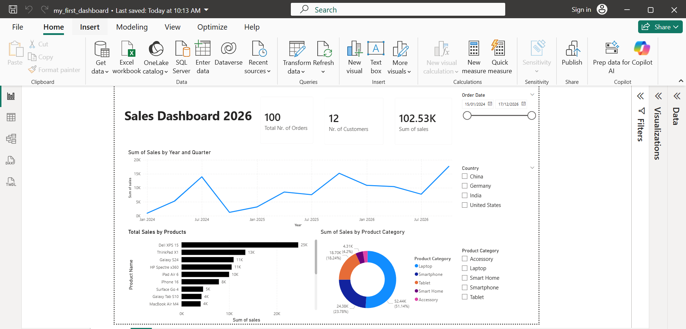

# 📊 Power BI Dashboard

> An interactive data dashboard built with Microsoft Power BI.

---

## 🖼️ Preview

<!-- Add a screenshot of your dashboard here -->


---

## 📌 Overview

This dashboard provides visual insights into **Sales Performance in 2026**. It was built using Microsoft Power BI and is designed to support data-driven decision making at a glance.

---

## ✨ Features

- 📈 Interactive charts and visual filters
- 🔍 Drill-through and cross-filtering capabilities
- 📅 Date range slicers for dynamic time analysis
- 🗂️ Single report pages covering different data dimensions
- 🎨 Clean, responsive layout optimised for both desktop and presentation mode

---

## 🗂️ Repository Structure

```
📁 PowerBI-project/
├── 📄 README.md               # You are here
├── 📁 datasets/
│   └── customers.csv
    └── orders.csv       # Source data (sample/anonymised)
└── 📁 my_first_dashboard/
    └── my_first_dashboard.png  # Screenshot of the dashboard
    └── my_first_dashboard.pbix # Power BI project file
```

---

## 🚀 Getting Started

### Prerequisites

- [Microsoft Power BI Desktop](https://powerbi.microsoft.com/desktop/) (free download)

### How to Open

1. Clone or download this repository:
   ```bash
   git clone https://github.com/AdilGithub123/PowerBI-project.git
   ```
2. Open **Power BI Desktop**
3. Go to **File → Open** and select `dashboard.pbix`
4. If prompted, update the data source path to point to the `data/` folder

---

## 📂 Data Source

| Source | Description |
|--------|-------------|
| `customers.csv` | Basic customer information |
| `orders.csv` | Orders information from 2024-2026 |

> ⚠️ **Note:** The data included in this repo is sample/anonymised data for demonstration purposes only.

---

## 🛠️ Built With

- [Microsoft Power BI Desktop](https://powerbi.microsoft.com/)
- DAX (Data Analysis Expressions) for calculated measures
- Power Query (M language) for data transformation

---

## 🙋 Author

**Your Name**
- GitHub: [@AdilGithub123](https://github.com/AdilGithub123)
- LinkedIn: [My-LinkedIn](https://www.linkedin.com/in/adil-polat-65b8b5312/)

---

## 📄 License

This project is licensed under the [MIT License](LICENSE).

---

*Made with ❤️ and DAX*
